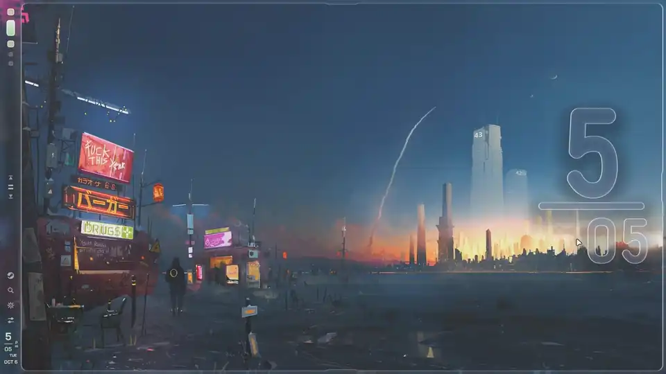
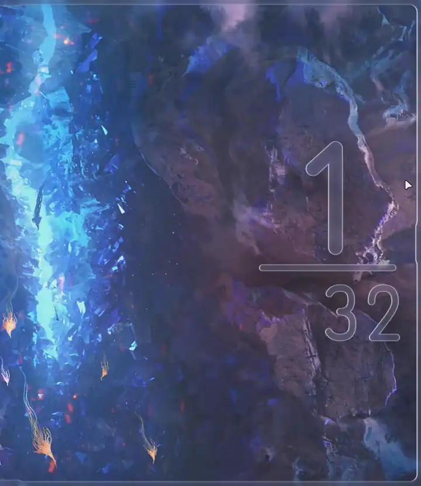
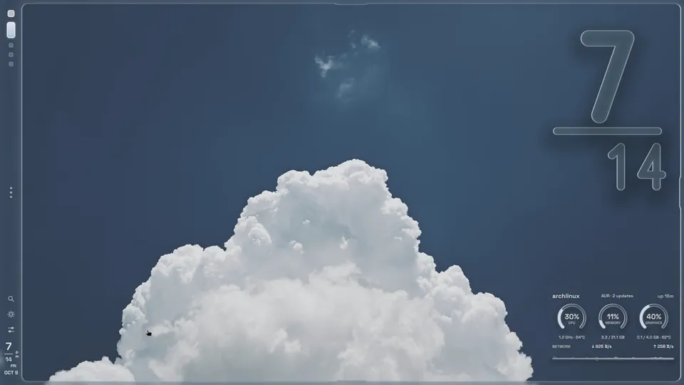

<div align="center">

  

  <p><strong>A liquid-glass desktop shell: a bar, and panels that flow out of it.</strong></p>

  <p>
    <a href="https://github.com/k4ditano/pleamar"></a>
    <a href="https://hyprland.org"></a>
    <a href="LICENSE"></a>
  </p>

  <table>
    <tr>
      <td align="center"><br /><sub>Panels flowing out of the bar</sub></td>
      <td align="center"><br /><sub>The wallpaper picker (<code>SUPER + B</code>)</sub></td>
    </tr>
    <tr>
      <td align="center"><br /><sub>A tour</sub></td>
      <td align="center"><br /><sub>The Desk</sub></td>
    </tr>
  <tr>
    <td align="center" colspan="2"><br /><sub>The lock screen</sub></td>
  </tr>
  </table>

</div>

---

> [!WARNING]
> **Vitreus is in active development.** Features, settings and behaviour can change at any time, and things may break
> between updates.

> **vit·re·us** _(Latin)_ — *of glass; glassy, transparent.*

**Vitreus** is a desktop shell for Wayland, written for [pleamar](https://github.com/k4ditano/pleamar). It is a single
floating pill of frosted glass at the top of the screen, or a strip down the left edge with a thin glass frame round
the screen. Everything else — the calendar, the quick controls, the player, the settings, the launcher, the volume
indicator, an incoming notification — is a drawer that grows out of the bar, joined to it by a liquid neck, in the same
glass, with the same spring, and folds back into it.

It is built to be *not boring*: a shell that morphs rather than pops. On pleamar the animation, the springs and the
layout all run in the renderer, and the logic only reports facts.

---

## 📸 Screenshots

<table>
  <tr>
    <td align="center"><br /><sub><b>Controls</b> — Wi-Fi, Bluetooth, brightness and volume</sub></td>
    <td align="center"><br /><sub><b>Calendar</b> — weather, month, and reminders</sub></td>
  </tr>
  <tr>
    <td align="center"><br /><sub><b>Launcher</b> — apps, files, commands, emoji, clipboard, wallpapers</sub></td>
    <td align="center"><br /><sub><b>Player and windows</b> — hangs from the window title</sub></td>
  </tr>
  <tr>
    <td align="center"><br /><sub><b>System tray</b> — an app's own menu, drawn in the shell's glass</sub></td>
    <td align="center"><br /><sub><b>Settings</b> — the About page shows the build and updates the shell</sub></td>
  </tr>
</table>

---

## ✨ Features

* **Two layouts** — an *island* pill along the top, or a *frame*: a strip down the left edge with glass round the screen.
* **Calendar** — month grid, reminders in plain words (`3:30pm Call mom`), and the weather for the week.
* **Controls** — Wi-Fi, Bluetooth, brightness, volume with a per-app mixer, Do Not Disturb, Caffeine, screenshots and
  screen recording, and power (lock, sleep, log out, restart, power off). A screenshot comes up as a card with its picture:
  open it, copy its text, ask about it, or delete it.
* **Player** — cover art, a live spectrum, and your running windows.
* **Launcher** (`SUPER + Space`) — apps, files, commands, emoji, clipboard history and wallpapers, with previews. A sum or a conversion (`5 km to mi`, `20 c in f`, `15% of 80`) is answered as you type; `?` or `!yt lofi` searches the web (twenty-one `!bang` sites, and DuckDuckGo's instant answer); `@` switches to an open window; `$` expands snippets and quicklinks from `snippets.json`.
* **Settings** (`SUPER + SHIFT + Space`) — wallpaper, theme, glass, display, Hyprland, notifications, clock and a system monitor.
* **Wallpaper picker** (`SUPER + B`) — your wallpapers as a honeycomb of glass hexagons, and (`Tab`) a row of slanted cards that changes the wallpaper live as you step through them, with a colour filter and each picture's size and kind. It opens on the one you used last.
* **Workspace overview** (`SUPER + TAB`) — a glass card per workspace; drag a window to move it.
* **Desk** (`SUPER + D`) — a panel out of the right edge: Focus timer, Shelf, Pad (tasks and drawing), a terminal, Ask, and Clip (your
  clipboard history, with pins).
* **Ask** — an AI chat in the Desk, with whichever assistants you have installed: Claude Code, Ollama (local models), Codex or
  Gemini. Answers stream in, you pick the assistant (and the Ollama model) in the panel, and the conversation is kept between sessions.
  Claude runs as a plain chat, with no tools and nothing saved, and its five-hour and seven-day usage shows as two thin bars with
  their reset times. Answers have a Copy button, and code comes in its own card. Send the clipboard, a Shelf card, a Clip entry or a
  screenshot's text to Ask as an attachment.
* **Notifications** — history, rules and sounds for each app, quiet hours, and silence while a window is fullscreen.
* **Authentication** — a polkit agent drawn in the same glass.
* **Lock screen**, **Night mode**, and a **desktop clock** drawn as glass.
* **Desktop** — right-click the bare wallpaper for a menu: **Webcam** (your camera in a round glass pane over everything; drag it, and pull its edge to resize it, as the Desk's corners do), the clock, the system monitor, and **New sticky note**. Stickers are glass notes, tinted from your palette, that stay where you put them and can be dragged onto other monitors.
* **Theme** — Iris recolours Vitreus from your wallpaper, or pick Tokyo Night, Catppuccin Mocha, Gruvbox, Nord, Rosé Pine or Dracula.

---

## 📦 Requirements

* [**pleamar**](https://github.com/k4ditano/pleamar) — the runtime Vitreus is written for
* **Hyprland** or **pleamar-wm**
* The **Space Grotesk** font

The packages `install.sh` installs (pacman, and the AUR for the last two):

| Package | Used for |
| --- | --- |
| `git`, `curl`, `fontconfig` | fetching Vitreus, weather and cover art, the launcher's web answers, and the font |
| `hyprsunset` | Night mode |
| `awww` | the wallpaper picker |
| `iris-colors` (AUR) | theming from the wallpaper |
| `mpvpaper` (AUR), `ffmpeg` | video wallpapers, and the webcam (`ffmpeg` reads the camera) |
| `imagemagick` | wallpaper thumbnails and the launcher's picture previews |
| `cava` | the bass pulse and the equalizer |
| `playerctl` | the player and its cover art |
| `networkmanager` | Wi-Fi |
| `bluez`, `bluez-utils` | Bluetooth |
| `brightnessctl` | the brightness slider |
| `hypridle` | Caffeine |
| `libnotify` | calendar reminders |
| `xdg-user-dirs`, `xdg-utils` | finding your Pictures folder, opening files and web searches |
| `wl-clipboard`, `cliphist` | the launcher's clipboard and copying (results, snippets) |
| `grim`, `slurp`, `wf-recorder` | screenshots and screen recording |
| `power-profiles-daemon` | the power profile |
| `polkit`, `python-gobject` | the authentication dialog |
| `python-pyte`, `ttf-space-mono-nerd` | the Desk's terminal |
| `pipewire-audio`, `sound-theme-freedesktop` | notification sounds |
| `tesseract`, `tesseract-data-eng` | the text of a screenshot |

---

## 🚀 Installation

**The quick way.** One script installs the packages Vitreus uses, pleamar itself, the font and the shell, and offers to
start it with your desktop. On Arch and its relatives it does everything; on other distributions it installs the shell
and lists what to add by hand.

```sh
curl -fsSL https://raw.githubusercontent.com/natepayn3/Vitreus/main/install.sh | sh
```

It asks before each step (`--yes` answers them all, `--dry-run` only says what it would do, `--help` lists the rest),
and running it again updates Vitreus. An update keeps what Settings changed in the shell's own files (which monitors
show the bar and the lock screen) and any edits of yours; if an edit of yours clashes with the new version, nothing is
updated and the script says so. `./install.sh --uninstall` takes it away and leaves your data.

**By hand.** Vitreus must live in pleamar's shells folder under the name `vitreus`: the palette it writes and the data
it keeps are found from there.

```sh
git clone https://github.com/natepayn3/Vitreus.git ~/.config/pleamar/shells/vitreus
cd ~/.config/pleamar/shells/vitreus
cp palette.default.plm palette.plm          # the lock screen's colours; Vitreus rewrites this file from your wallpaper
cp wm-palette.default.plm wm-palette.plm    # pleamar-wm's window borders; the same
pleamar --scene ~/.config/pleamar/shells/vitreus/vitreus.plm --no-hud
```

To start it with the desktop, add `vitreus-keep ~/.config/pleamar/shells/vitreus/vitreus.plm` to `~/.config/pleamar/autostart`
(after linking `bin/vitreus-keep` into `~/.local/bin`: it runs the scene and starts it again if it ever stops, such as a crash
when a monitor wakes; the installer does the same for the lock screen, the wallpaper transition and the desktop clock), and on Hyprland put
`exec-once = pleamar --autostart` in your config (`hl.on("hyprland.start", …)` in a Lua config). The scene reloads
itself whenever a file in the folder is saved.

Two things the script does that you would do by hand: link `bin/vitreus-clipimg` into a folder on your `PATH` (the
launcher's clipboard pictures), and, on Hyprland with a Lua config, load the key binds and what Settings saves:

```lua
require("hypr_vitreus")                 -- SUPER + Space launcher, SUPER + SHIFT + Space settings, SUPER + L lock
pcall(require, "vitreus_monitors")      -- written by Settings > Display
pcall(require, "vitreus_hypr")          -- written by Settings > Hyprland
```

after linking `hypr_vitreus.lua` into `~/.config/hypr`. (The script adds these lines to the end of `hyprland.lua`
after asking, keeps a copy as `hyprland.lua.before-vitreus`, and takes them out again on `--uninstall`.)

Vitreus takes over `org.freedesktop.Notifications` from whatever handled notifications before it, and hands it back
when it exits.

---

## ⚙️ Configuration

Vitreus keeps its data in `~/.local/share/pleamar/vitreus`.

### 🎨 Theming with Iris

Iris reads your wallpaper and Vitreus recolours itself, with a legibility floor on the
text. It takes about half a second after a wallpaper change.

---

## 📄 License

Vitreus is released under the [MIT License](LICENSE). It runs on [pleamar](https://github.com/k4ditano/pleamar), which
is BSD-3-Clause and is not part of this repository.
