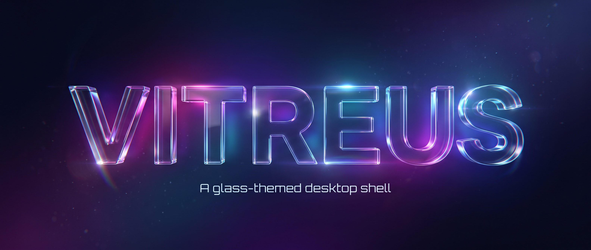
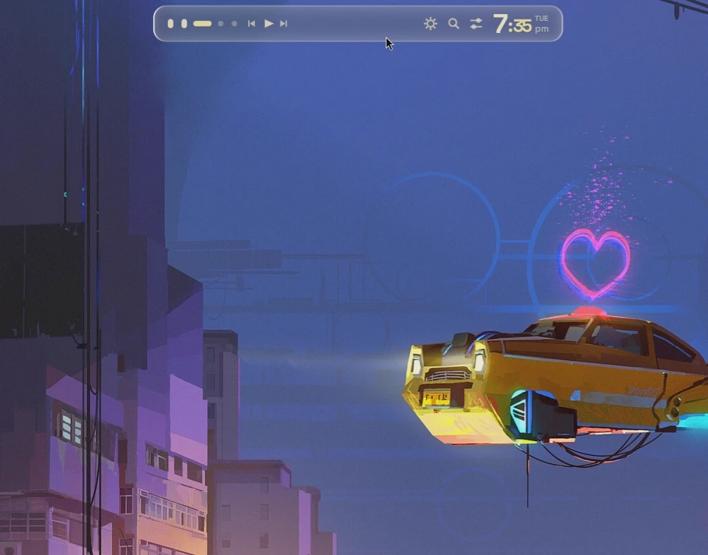
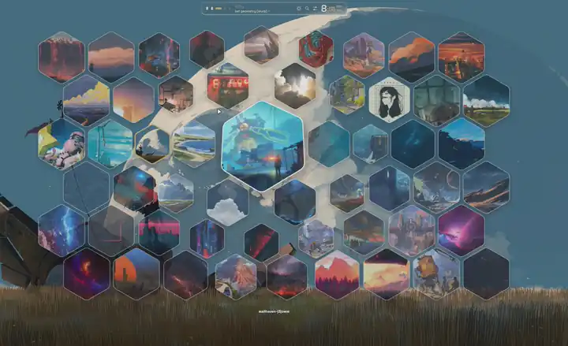
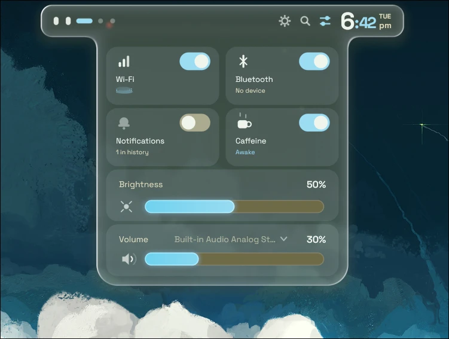
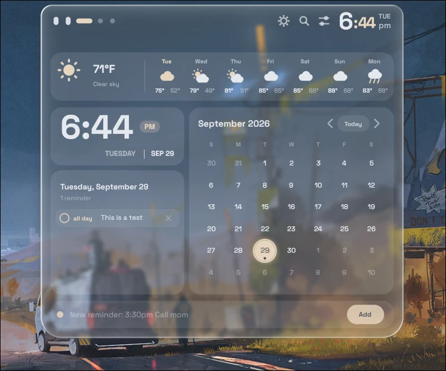
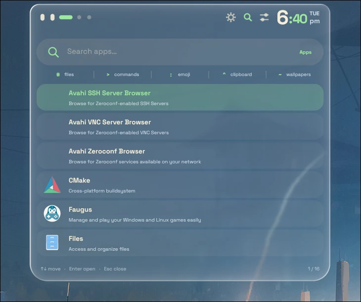
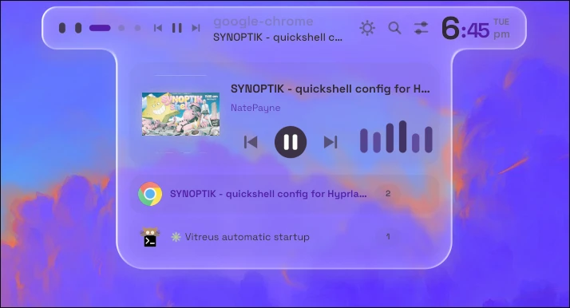
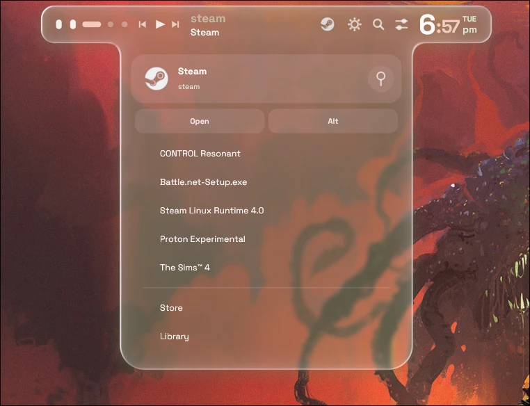
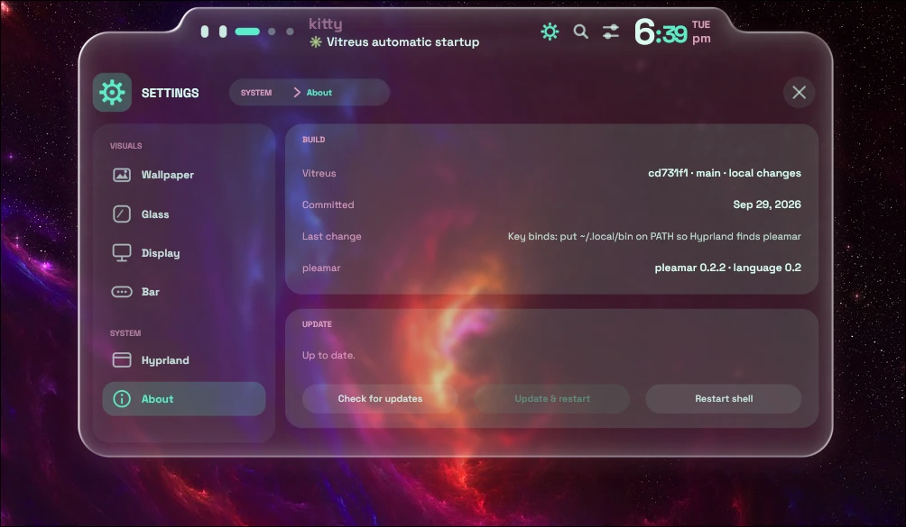

<div align="center">

  

  <p><strong>A liquid-glass desktop shell: a bar, and panels that flow out of it.</strong></p>

  <p>
    <a href="https://github.com/k4ditano/pleamar"></a>
    <a href="https://hyprland.org"></a>
    <a href="LICENSE"></a>
  </p>

  
  
  <br /><sub>Panels flowing out of the bar &nbsp;·&nbsp; the wallpaper picker (<code>SUPER + B</code>)</sub>

</div>

---

> [!WARNING]
> **Vitreus is in active development.** Features, settings and behaviour can change at any time, and things may break
> between updates.

> **vit·re·us** _(Latin)_ — *of glass; glassy, transparent.*

**Vitreus** is a desktop shell for Wayland, written for [pleamar](https://github.com/k4ditano/pleamar). It is a single
floating pill of frosted glass at the top of the screen, or a strip down the left edge with a thin glass frame round
the screen. Everything else — the calendar, the quick controls, the player, the settings, the launcher, the volume
indicator, an incoming notification — is a drawer that grows out of the bar, joined to it by a liquid neck, in the same
glass, with the same spring, and folds back into it.

It is built to be *not boring*: a shell that morphs rather than pops. On pleamar the animation, the springs and the
layout all run in the renderer, and the logic only reports facts.

---

## 📸 Screenshots

<table>
  <tr>
    <td align="center"><br /><sub><b>Controls</b> — Wi-Fi, Bluetooth, brightness and volume</sub></td>
    <td align="center"><br /><sub><b>Calendar</b> — weather, month, and reminders</sub></td>
  </tr>
  <tr>
    <td align="center"><br /><sub><b>Launcher</b> — apps, files, commands, emoji, clipboard, wallpapers</sub></td>
    <td align="center"><br /><sub><b>Player and windows</b> — hangs from the window title</sub></td>
  </tr>
  <tr>
    <td align="center"><br /><sub><b>System tray</b> — an app's own menu, drawn in the shell's glass</sub></td>
    <td align="center"><br /><sub><b>Settings</b> — the About page shows the build and updates the shell</sub></td>
  </tr>
</table>

---

## ✨ Features

**Two layouts** (Settings > Bar)
* **Island** — the floating pill along the top. Its pieces (workspaces, title, clock, buttons, tray) can be reordered
  and hidden in the piece editor on the same page.
* **Frame** — the bar becomes a strip down the left edge, and a thin frame of the same glass runs round the other three
  edges of the screen. The calendar, the controls and the player come out of the strip on a click (on the clock, the
  controls icon and the window title). Touching the middle of the top frame brings a small tab out of it that opens the
  launcher; the bottom frame's opens Settings, and the right frame's opens the Desk.

**The bar**
* Workspace indicator whose dots morph into capsules and a wide accent pill.
* The focused window's app and title, mini media controls, and a clock with an oversized hour, accent-coloured
  minutes and the weekday stacked over the am/pm.
* Buttons for Settings, the launcher (a magnifying glass) and the controls, left of the clock.
* Text and icons are drawn outside the bar's bass-wave shader with a soft shadow, so they stay sharp and legible on
  light wallpapers.

**Panels** — each one is a drawer from the bar, centred, that swells out of the bar on a spring, stays joined to it by a liquid neck, and settles with a little wobble,
with its content fading in after the glass has settled
* **Calendar** — a clock card, a month grid, reminders you can write in plain words (`3:30pm Call mom`) that fire a
  desktop notification when due, and a weather strip: now, and the next seven days.
* **Controls** — Wi-Fi and Bluetooth tiles that each open their own window (scan, connect, forget, password entry),
  a **Notifications** module (Do Not Disturb with a timer, and a notification history), Caffeine (with timers),
  **Capture** (a screenshot of a region or the whole screen, copied and saved to `~/Pictures/Screenshots`, and a screen
  recording into `~/Videos`, started and stopped from the tile's button) and **Power** (lock, sleep, log out,
  restart and power off, each of which has to be held for one second; and the power profile, on a sliding glass switch), brightness, volume with an output picker and a per-app mixer (right-click the volume card, or press its dots: one
  slider and mute button for each app playing sound; needs `pactl`).
* **Player** — a media card with cover art and a live spectrum from `cava`, plus the running windows (focus or close
  them) and background apps from the tray.
* **Launcher** (`SUPER + Space`) — a search field over its results; the first character picks the search: apps (with
  their descriptions, most-used first, and a sum is answered as you type), `#` files, `>` commands, `:` emoji, `^` the
  clipboard history, `~` wallpapers. Files, wallpapers and the clipboard have a preview beside the rows: the picture
  or the text, and the file's size, date and type. Arrows and Enter, or the mouse.
* **Settings** (`SUPER + SHIFT + Space`) — a sidebar and pages of cards.
  *Visuals:* **Wallpaper** (a gallery of your wallpaper folder with a preview, Random, paging, a slideshow, and a
  colour filter), **Glass** (how frosted and how solid the panels are), **Display** (a canvas to arrange your
  monitors, mode, refresh rate, scale, rotation, SDR levels, saved profiles; a change is on trial for 15 seconds and
  goes back unless you keep it). *System:* **Hyprland** (layout, gaps, resize from border, tearing, animations,
  pointer sensitivity, focus following, natural scroll).
* **Wallpaper picker** (`SUPER + B`) — every wallpaper as a glass hexagon in a honeycomb centred on the screen, ordered
  round the colour wheel. How many wallpapers you have sets how big the hexagons are. The one under the pointer swells
  with a slight bounce and tilts in 3D toward the pointer while the tiles round it make room; click one and it blooms
  out of the tile as the new wallpaper. The first time it opens it reads your wallpapers once (thumbnails are cached);
  `Esc` or a click outside closes it.
* **Workspace overview** (`SUPER + TAB`, right-click the bar's workspace dots, or the launcher) — five glass cards, each a 16:9
  screen for a workspace, its windows laid out as pictures in a grid that grows with their number (one fills the
  screen, two sit side by side, up to nine in three by three). A compositor will not stream a window it is not showing, so the
  pictures are taken with `grim` a moment after you arrive on a workspace and just before the overview opens; a window on another
  workspace shows the last picture taken of it (its icon, until one has been). Click a window to go to it, drag it onto another
  workspace to move it there, or click anywhere else on a screen to go to that workspace; `Esc` or a click outside closes it.
* **Authentication** — Vitreus is the session's polkit agent. When something asks for admin rights (`pkexec`, a disk or
  package tool's GUI), a card in the bar's glass asks for your password over a dimmed desktop: it says what is being
  asked, whose password it is, shakes when the password is wrong, and `Esc` cancels. The password is read out of the
  scene's field by the agent over pleamar's own socket, so it is never on a command line or on disk. Only one agent can
  hold a session: if polkit-gnome or hyprpolkitagent is already running, that one keeps answering (see Requirements).
* **Notification rules and sounds** (Settings > System > Notifications) — one place decides what happens to each notification:
  whether it is shown, heard and kept in the history, and for how long. Per app (the apps that have sent you something are
  listed): mute its popups (still kept in the history), silence its sound, let it through Do Not Disturb, keep it out of the
  history altogether, force its urgency, choose how long it stays (or until you close it), and give it its own sound from
  eight. Globally: sounds on or off, the default sound, and whether critical notifications (a low battery, a failed build)
  get through Do Not Disturb. Each app's page says in words what will now happen to it, and a button sends a test.
* **System monitor** (Settings > System) — a scrolling page of live cards: the machine's name, uptime and load; the CPU as a
  gauge with a minute of history and a bar for each core; memory as a ring (in use, cache, free) with swap; the graphics card
  (load, video memory, power, temperature, fan and clocks; NVIDIA through `nvidia-smi`, AMD through sysfs); the network as a
  mirrored graph of what comes in and goes out; each drive's space and its read and write traffic; every temperature sensor and
  fan; and the busiest programs. The numbers come from `bin/vitreus-sysmon`, which reads `/proc` and `/sys` and runs only while
  the page is open (about 1.5 % of a core), so nothing polls in the background.
* **Volume** — a small face and a wave whose curves stretch out as the volume rises.
* **Notifications** — Vitreus is the notification server. Banners grow to fit their title, body and buttons; critical
  ones stay until dismissed; everything lands in the history, including what Do Not Disturb held back.

**Desk** — a panel of small tools that comes out of the right frame (Frame layout), or from an icon at the top right
(Island layout). It stays open while you work in other windows, and has four tabs:
* **Focus** — a ring timer of 15, 30, 45 or 60 minutes with start, pause and reset; starting it can also turn on Do Not
  Disturb and keep the machine awake for that long. A notification says when it is done.
* **Shelf** — drop anything on the panel (files, links, text) to keep it as a card, up to eight, and drag a card back out
  into another program.
* **Pad** — a short task list with checks, and a drawing board.
* **Term** — your shell, drawn in the panel's own glass (64 by 35 characters). Click it once to type; after that the keyboard
  follows the mouse, like your windows: off the panel it goes back to them, and back over the panel it is the terminal's again,
  until you close the panel or pick another tab. The wheel (or Shift+PageUp/PageDown) scrolls back, Ctrl+Shift+V pastes. The shell
  keeps running when the panel closes. `bin/vitreus-term` runs it and keeps its screen, which needs `python-pyte`;
  it is drawn in SpaceMono Nerd Font (`sudo pacman -S python-pyte ttf-space-mono-nerd`).

**Wallpaper transition** — picking a wallpaper in the picker dissolves it in through a honeycomb of hexagons that opens in a wave from the
tile you clicked (`wptrans/`). It is a scene of its own on the bottom layer, above your wallpaper and under every window: it makes the
picture at the screen's size, shows it through a shader, and has awww switch to it the moment it covers the screen. The installer starts it with
the desktop; when it is not running a pick uses awww's own transition.

**Desktop clock** — the time in digits drawn as glass, on your desktop (`desktopclock/`). It is a scene of its own on the bottom layer, above your
wallpaper and under every window: each digit is a single stroke, and together they are one body of glass, so the light runs round their edges and the
compositor blurs the wallpaper behind them (it never bends it with real lens glass, which would cost power). The installer starts it with the desktop.
Settings > Clock (under Visuals) has the switch (it turns the running clock on or off, no reload) and the look: six layouts as badges (a pipe between the hour and the minutes, a rule, a tower, a capsule, a slash, and a hero), where it sits on a 3 by 3 grid of the screen, its size, 12 or 24 hours, the weight of the strokes,
and how clear the glass is. Its tint is always the shell's own, the same as the bar's glass. "Desktop clock: toggle" in the launcher shows or hides it too. It keeps its settings in `desktopclock.json` (in
`~/.local/share/pleamar/desktopclock`): `shown`, `use_12_hour`, `size` (the digits' height in pixels, 100 to 340), `layout` (0 to 5), `position`
(`top_left`, `top`, `top_right`, `left`, `center`, `right`, `bottom_left`, `bottom` or `bottom_right`), `weight` (0 to 2) and `clarity` (0 to 2).

**Other compositors** — the shell is a pleamar shell, so it is not tied to Hyprland. [`pleamar-wm/`](pleamar-wm/README.md) has what makes it
run on pleamar-wm, which can be chosen at a login screen: its keys, an idle config, a `hyprctl` shim, the window manager's own scene with slim glass
title bars, and a script that puts it in the list of sessions. Some pages that talk to Hyprland (Hyprland, Display, the overview's window list,
Night mode) do not work there yet.

**Lock screen** — a lock screen, in [`lockscreen/`](lockscreen/README.md). It is a scene of its own
(a session lock has to be its own program), and the installer starts it with the desktop: the lock buttons and `SUPER + L` need it running.

**Theming** — [Iris](#-theming-with-iris) reads your wallpaper and Vitreus recolours itself, with a legibility floor on
the text. It takes about half a second after a wallpaper change.

---

## 📦 Requirements

* [**pleamar**](https://github.com/k4ditano/pleamar) — the runtime Vitreus is written for.
* A Wayland compositor with layer-shell. It is developed on **Hyprland**; the running-windows list uses `hyprctl`,
  so that part is Hyprland-only.
* [**hyprsunset**](https://github.com/hyprwm/hyprsunset), on Hyprland — Hyprland's blue-light filter, which Night mode drives
  (the installer requires it there; elsewhere Night mode is not available). It tints the screen by handing the compositor a colour transform, so nothing is re-rendered.
* The **Space Grotesk** font.

Optional, each enabling one thing (Vitreus runs without them and that part stays quiet):

| Tool | Used for |
| --- | --- |
| `cava` | the bass pulse in the bar and the equalizer in the player |
| `playerctl` | cover art for the player |
| `awww` | the wallpaper picker, and Iris following your wallpaper |
| `mpvpaper` (AUR) + `ffmpeg` | video wallpapers (mp4, webm) in the wallpaper picker: mpvpaper plays the video over awww, and ffmpeg takes the frame (kept in the cache) that Iris, the thumbnails and the lock screen read |
| `iris` | theming from the wallpaper |
| `imagemagick` | wallpaper thumbnails (cropped once, cached), and the launcher's picture previews |
| `wl-clipboard` (`wl-copy`) | the launcher copying an emoji, a sum's answer or a clipboard entry |
| `cliphist` | the launcher's clipboard search (`^`). Something has to fill it: `wl-paste --watch cliphist store` at startup |
| `xdg-utils` (`xdg-open`) | the launcher opening a file |
| `curl` | weather and remote cover art |
| NetworkManager (`nmcli`) | Wi-Fi scanning |
| BlueZ (`bluetoothctl`) | Bluetooth scanning |
| `brightnessctl` | the brightness slider |
| `hypridle` + systemd | Caffeine |
| `grim` + `slurp` + `wl-clipboard` | Capture's screenshots (a region is picked with `slurp`) |
| `wf-recorder` + `slurp` | Capture's screen recording (video only, no audio) |
| `power-profiles-daemon` (`powerprofilesctl`) | the power profile in Power |
| `systemd` (`systemctl`, `loginctl`) | Power's sleep, restart, power off and log out |
| `polkit` + `python-gobject` | the authentication dialog (`bin/vitreus-polkit-agent`, started by the shell; needs no other agent running) |
| `python-pyte` + `ttf-space-mono-nerd` | the Desk's terminal (`bin/vitreus-term`; the font is Space Grotesk's monospaced sibling, with the Nerd Font icons prompts use) |
| `pipewire-audio` (`pw-play`) + `sound-theme-freedesktop` | the sounds notifications make |
| `pactl` (PipeWire or PulseAudio) | the per-app volume mixer |
| `hyprctl` | running windows, Settings > Display and > Hyprland, and the launcher starting apps |
| `notify-send` | calendar reminders |

---

## 🚀 Installation

**The quick way.** One script installs the packages Vitreus uses, pleamar itself, the font and the shell, and offers to
start it with your desktop. On Arch and its relatives it does everything; on other distributions it installs the shell
and lists what to add by hand.

```sh
curl -fsSL https://raw.githubusercontent.com/natepayn3/Vitreus/main/install.sh | sh
```

It asks before each step (`--yes` answers them all, `--dry-run` only says what it would do, `--help` lists the rest),
and running it again updates Vitreus. An update keeps what Settings changed in the shell's own files (which monitors
show the bar and the lock screen) and any edits of yours; if an edit of yours clashes with the new version, nothing is
updated and the script says so. `./install.sh --uninstall` takes it away and leaves your data.

**By hand.** Vitreus must live in pleamar's shells folder under the name `vitreus`: the palette it writes and the data
it keeps are found from there.

```sh
git clone https://github.com/natepayn3/Vitreus.git ~/.config/pleamar/shells/vitreus
cd ~/.config/pleamar/shells/vitreus
cp palette.default.plm palette.plm          # the lock screen's colours; Vitreus rewrites this file from your wallpaper
cp wm-palette.default.plm wm-palette.plm    # pleamar-wm's window borders; the same
pleamar --scene ~/.config/pleamar/shells/vitreus/vitreus.plm --no-hud
```

To start it with the desktop, add `vitreus-keep ~/.config/pleamar/shells/vitreus/vitreus.plm` to `~/.config/pleamar/autostart`
(after linking `bin/vitreus-keep` into `~/.local/bin`: it runs the scene and starts it again if it ever stops, such as a crash
when a monitor wakes; the installer does the same for the lock screen, the wallpaper transition and the desktop clock), and on Hyprland put
`exec-once = pleamar --autostart` in your config (`hl.on("hyprland.start", …)` in a Lua config). The scene reloads
itself whenever a file in the folder is saved.

Two things the script does that you would do by hand: link `bin/vitreus-clipimg` into a folder on your `PATH` (the
launcher's clipboard pictures), and, on Hyprland with a Lua config, load the key binds and what Settings saves:

```lua
require("hypr_vitreus")                 -- SUPER + Space launcher, SUPER + SHIFT + Space settings, SUPER + L lock
pcall(require, "vitreus_monitors")      -- written by Settings > Display
pcall(require, "vitreus_hypr")          -- written by Settings > Hyprland
```

after linking `hypr_vitreus.lua` into `~/.config/hypr`. (The script adds these lines to the end of `hyprland.lua`
after asking, keeps a copy as `hyprland.lua.before-vitreus`, and takes them out again on `--uninstall`.)

Vitreus takes over `org.freedesktop.Notifications` from whatever handled notifications before it, and hands it back
when it exits.

---

## ⚙️ Configuration

Vitreus keeps its data in `$XDG_DATA_HOME/pleamar/vitreus` (`~/.local/share/pleamar/vitreus`). The settings panel is
still growing, so a few settings are plain files there:

| File | What it holds |
| --- | --- |
| `iris.json` | `{ "enabled": true, "intensity": "medium" }` — `subtle`, `medium` or `bold` |
| `weather-config.json` | `{ "location": "", "units": "fahrenheit" }` — a place name, or empty for IP-based; or `celsius` |
| `dnd.json` | Do Not Disturb: by hand, and any timer still running |
| `caffeine.json` | Caffeine: the timer still running |
| `glass.json` | the Glass page: how frosted and how solid |
| `wallpaper.json`, `wallpaper-colors.json` | the wallpaper slideshow, and the colours found in each picture |
| `display.json`, `display-profiles.json` | the Display page: what was kept, and the saved profiles |
| `launcher.json` | how often each app was started from the launcher |
| `calendar.json` | your reminders |
| `notification-history.json` | the notification history |

The wallpaper picker reads `<Pictures>/Wallpapers`. Thumbnails are cached in `$XDG_CACHE_HOME/pleamar/vitreus/wp`.

Two files Settings writes are Lua, for Hyprland to load at start: `~/.config/hypr/vitreus_monitors.lua` (Display) and
`~/.config/hypr/vitreus_hypr.lua` (Hyprland). Changes are also sent to the running Hyprland at once.

### 🎨 Theming with Iris

The scene's colours are `let`s in `palette-live.plm`, each one `rgb(pal_ink_r, pal_ink_g, pal_ink_b)`: three facts. When the
wallpaper changes, Vitreus runs `iris --json-only`, applies a contrast floor and your chosen intensity, and sets those facts: the
colours change on the spot, with no file written and no reload. (This needs a pleamar with `rgb()`.) The lock screen is another
program and cannot see the shell's facts, so it still imports `palette.plm`, which the logic rewrites; that file is git-ignored,
and the stock colours are tracked as `palette.default.plm`. pleamar-wm's window borders work the same way, with
`wm-palette.plm` and `wm-palette.default.plm`. The last palette is kept in `palette.json` in the data folder, so a
start paints it from the first frame.

---

## 🧩 Layout

| File | |
| --- | --- |
| `vitreus.plm` | the scene: every shape, panel, spring and rule |
| `pages/*.plm` | the scene's big pieces, each a `part` pulled in with `include` (the bar, the desk, the drawers, the overview, every Settings page): same scene, in more files |
| `vitreus.luau` | the logic: services, scanning, weather, Iris, history, the launcher's searches — it only reports facts |
| `logic/*.luau` | the logic's self-contained features (Term, Pad, Shelf, Focus, tray, night mode, updates…), each loaded with `require` and handed what it shares |
| `hypr_vitreus.lua` | Hyprland key binds: `SUPER + Space` launcher, `SUPER + SHIFT + Space` Settings, `SUPER + L` lock |
| `bin/vitreus-clipimg` | a helper for the launcher's clipboard pictures (thumbnail, copy back) |
| `bin/vitreus-keep` | runs a scene from autostart and starts it again if it stops, while the session lasts |
| `assets/emoji.json` | the emoji the launcher searches |
| `install.sh` | installs, updates and removes Vitreus |
| `palette-live.plm` | the shell's colours, as `rgb()` of the `pal_*` facts the logic sets |
| `palette.default.plm` | the stock palette (copy to `palette.plm`, for the lock screen) |
| `wm-palette.default.plm` | pleamar-wm's stock border colour (copy to `wm-palette.plm`) |
| `wave.wgsl` | the shader that bends the bar's glass on the beat |
| `desktopclock/` | the desktop clock: digits of glass on the bottom layer |
| `lockscreen/` | the lock screen, started with the desktop; see its README |
| `wptrans/` | the wallpaper picker's hexagon dissolve, on the bottom layer |
| `pleamar-wm/` | what makes Vitreus run on pleamar-wm; see its README |

---

## Known limits

* awww forgets nothing it was told to show, but it only restores what it last displayed (`awww restore`, run at startup);
  a wallpaper that was never applied through awww is not brought back.
* The launcher's file search looks five folders deep in your home, skipping hidden folders. Clipboard history is only
  as good as what fills `cliphist`; the launcher's apps come from the desktop files pleamar can see.
* Settings > Hyprland and Display write Lua for Hyprland's Lua config; with a `hyprland.conf` they still change the
  running session, but nothing is kept for the next start.
* Settings > Display has only been tried with one monitor: arranging several is untested.
* Bluetooth and Wi-Fi scans go through `bluetoothctl` and `nmcli`: pleamar's own scan calls answer without error but
  nothing scans.
* Wi-Fi rescans within about 15 seconds of the previous one are ignored by NetworkManager.
* Do Not Disturb has a timer, but no quiet-hours schedule and no "silence while a window is fullscreen" trigger yet.

---

## 📄 License

Vitreus is released under the [MIT License](LICENSE). It runs on [pleamar](https://github.com/k4ditano/pleamar), which
is BSD-3-Clause and is not part of this repository.
